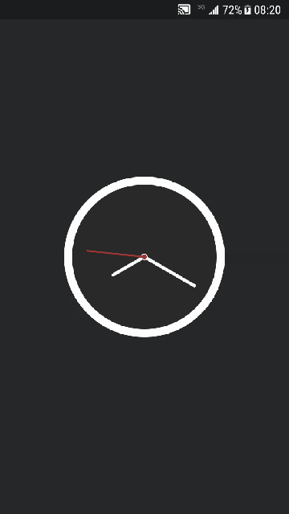

# My Flutter Challenges

Here I share all my Flutter challenges and source code

## Challenges

|[Flutter Clock](clock)|[Infinite Scroll](infinite_scroll)|[Infinite Scroll](infinite_scroll)|
|:-:|:-:|:-:|
||||
|A Clock builtin with Canvas (CustomPaint) Original Design from [Dribbble](https://dribbble.com/shots/6783041-Clock)|Infinite Scroll + REST API Read my article on Medium about the implementation [here](https://medium.com/@e200/flutter-infinite-scroll-with-rest-api-2b11f64b9d02)|An implementation of Infinite Scroll + REST API|
